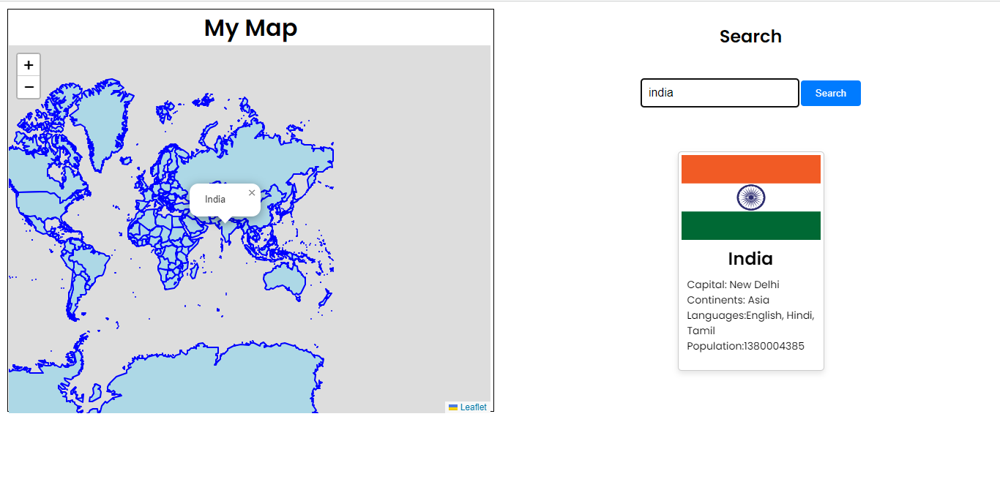

Of course! Here's the README text with headings and code blocks highlighted appropriately:

````markdown
# World Map Application

![World Map Application Screenshot]


A world map application built using React and JavaScript. The application displays a map of the world, allowing users to click on a country to fetch and display country-specific details such as demographics, geography, and other relevant information.

## Table of Contents

- [Features](#features)
- [Requirements](#requirements)
- [Getting Started](#getting-started)
- [Usage](#usage)
- [Bonus Features](#bonus-features)
- [Contributing](#contributing)
- [License](#license)

## Features

- **Map Display using Leaflet:** Interactive world map with zoom and pan functionalities.
- **Country Selection:** Click on a country to fetch and display country-specific details.
- **API Integration:** Retrieves country-specific data from a RESTful API.
- **Display Country Details:** Displays relevant information about the selected country.
- **Reusable React Components:** Organized codebase with proper component hierarchy and state management.
- **Styling:** CSS styles applied for a visually appealing UI.

## Requirements

- Node.js (>=10.16.0)
- React (>=16.8.0)
- Leaflet (>=1.7.1)

## Getting Started

1. **Clone the Repository:**

   ```bash
   git clone https://github.com/your-username/world-map-application.git
   ```
````

2. **Navigate to the Project Directory:**

   ```bash
   cd world-map-application
   ```

3. **Install Dependencies:**

   ```bash
   npm install
   ```

## Usage

1. **Start the Development Server:**

   ```bash
   npm start
   ```

2. **Open Your Web Browser:**

   Navigate to `http://localhost:3000` to explore the world map, click on countries, and view country-specific details.

## Bonus Features

- **Caching:** Implemented caching to avoid redundant API calls for the same country.
- **Neighboring Countries:** Highlight neighboring countries on the map.
- **Search Bar:** Search for countries by name or filter based on criteria.
- **Error Handling:** User-friendly messages for API or data retrieval issues.

## Contributing

Contributions are welcome! If you have any improvements or features to add, feel free to submit a pull request.

1. Fork the repository.
2. Create a new branch: `git checkout -b feature/your-feature-name`
3. Make your changes and commit them: `git commit -m 'Add some feature'`
4. Push to the branch: `git push origin feature/your-feature-name`
5. Open a pull request.

## License

This project is licensed under the [MIT License](LICENSE).

```

Just replace `your-username` in the URLs with your actual GitHub username and make any other necessary adjustments according to your project setup.
```
